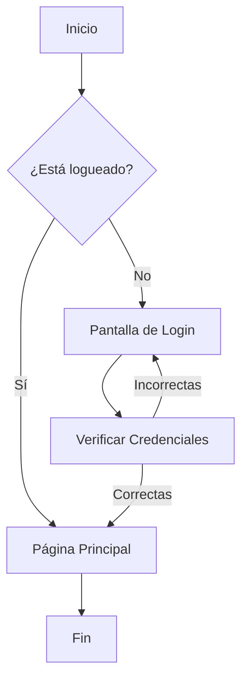

tomando como referencia el estándar LBS, dame un resumen enfocado en la línea de tiempo y en las ventajas y desventajas reales de los sistemas existentes para butear un pc con linux instalado, no quiero que esté basado en las influencias, p.ej., la de Microsft imponiendo UEFI y TMP, sino que como dije, en tas ventajas y desventajas empíricas, agrega al resumen, insisto, basado en la LBS, cuándo y por qué existen las particiones /boot y /boot/efi, y las diferencias con el directorio /boot, detallando qué se aloja en él y qué no debería alojar, p.ej., imagino que en LBS o en algún otro estándar se defino el porqué /boot es de 1MB y /boot/efi es de aproximadamente 300 MB, citando cuándo y porqué se elije no crear /boot como directorio como partición, y en ese caso que pasa con la o las particiones ya existentes con el mismo nombre

La Base Estándar de Linux (LSB) es un conjunto de estándares diseñados para aumentar la compatibilidad entre diferentes distribuciones de Linux. Básicamente, busca que los programas puedan ejecutarse en cualquier sistema Linux que cumpla con estos estándares. 

## ¿Qué es la LSB?

### La LSB define estándares para:
Estructura del sistema de archivos: Define cómo se organizan los directorios y archivos en el sistema. 

**Comandos del sistema**: Establece qué comandos deben estar disponibles y cómo deben funcionar. 
**Bibliotecas**: Especifica qué bibliotecas estándar deben estar presentes.
 
## ¿Por qué es importante la LSB?

La LSB facilita el desarrollo de software para Linux, ya que los desarrolladores pueden crear aplicaciones que funcionen en diversas distribuciones sin necesidad de realizar modificaciones específicas para cada una. Esto reduce costos y esfuerzo para los desarrolladores y para quienes dan soporte a las aplicaciones. 

## ¿Quiénes participan en la LSB?

La LSB es un proyecto conjunto de varias distribuciones de Linux y es mantenido por la Fundación Linux. 

## ¿En qué se basa la LSB?

La LSB se basa en otros estándares abiertos como POSIX y la Especificación Única de UNIX, pero también los extiende en ciertas áreas. 

## En resumen, la LSB busca:
**Unificar el desarrollo de software para Linux**.

**Aumentar la compatibilidad entre distribuciones**.

**Facilitar la portabilidad de aplicaciones entre diferentes sistemas Linux**. 

ChatGPT dijo:
Te voy a dar el resumen basándome en la FHS (Filesystem Hierarchy Standard) y en la forma en que Linux From Scratch (LFS) documenta el uso de /boot y /boot/efi, pero sin meterme en la narrativa de “Microsoft lo impuso” ni en argumentos de política. Lo enfocaré en línea de tiempo, ventajas y desventajas empíricas, y decisiones de diseño reales sobre /boot y /boot/efi.

## 📜 Línea de tiempo resumida (en relación a arranque en Linux)
| Año aprox.    | Hito                                | Detalle técnico                                                                                                                                                                                                                                                                                        |
| ------------- | ----------------------------------- | ------------------------------------------------------------------------------------------------------------------------------------------------------------------------------------------------------------------------------------------------------------------------------------------------------ |
| **1991–1994** | Linux inicial + LILO                | El cargador de arranque **LILO** cargaba el kernel directamente desde el MBR o desde una partición activa. `/boot` era un **directorio** en la raíz, no necesariamente una partición.                                                                                                                  |
| **1999**      | GRUB (Legacy)                       | Aparece **GRUB** que soporta más sistemas de archivos y configuraciones flexibles. Se recomienda **separar `/boot` en una partición** en sistemas donde el BIOS o el cargador no soportan leer todo el disco o FS complejos (ej. RAID, LVM, XFS…).                                                     |
| **2005–2010** | GRUB2                               | Mejora soporte de FS, GPT y carga módulos. El uso de partición `/boot` empieza a ser opcional en más casos, salvo cuando el arranque directo desde root FS no es posible.                                                                                                                              |
| **2010–2015** | UEFI reemplaza progresivamente BIOS | Aparece la **EFI System Partition (ESP)**: `/boot/efi` en Linux. Necesaria para que el firmware cargue un EFI executable (GRUB, systemd-boot, etc.). FAT32 es obligatorio por especificación UEFI.                                                                                                     |
| **2015–hoy**  | Flexible mix BIOS+UEFI              | Sistemas modernos permiten: solo `/boot` (dentro de `/`), `/boot` como partición, `/boot/efi` como ESP independiente, o combinaciones. El uso de `/boot` como partición es cada vez menos frecuente en equipos domésticos, pero sigue siendo común en entornos corporativos con requisitos especiales. |


## 📂 ¿Qué es /boot según FHS y LFS?

- Propósito: Contener todo lo necesario para que el sistema arranque antes de montar el resto del sistema de archivos.

- Contenido típico:
	- Kernel Linux (vmlinuz-...)
	- Initramfs / initrd
	- Archivos de configuración de GRUB (grub.cfg, módulos)
	- Mapas de sistema (ej. System.map)
- Lo que NO debería alojar:
	- Binarios de usuario
	- Módulos del kernel (estos van en /lib/modules)
	- Archivos no relacionados al arranque

## 📂 ¿Qué es /boot/efi?
- Es punto de montaje de la EFI System Partition (ESP).
- Contenido típico:
	- Archivos .efi (GRUB EFI, systemd-boot, shim)
	- Configuración mínima para el cargador EFI
	- Puede contener múltiples bootloaders para distintos SO
- Formato: FAT32 (por especificación UEFI)
- Tamaño recomendado:
	- Linux From Scratch no lo fija exactamente, pero la práctica habitual es 200–500 MB, siendo 300 MB un estándar de facto para permitir varios kernels y entradas.

## 📏 ¿Por qué /boot de 1 MB y /boot/efi de ~300 MB?
(Aclaración: el "1 MB" de /boot en realidad se refiere al BIOS Boot Partition, no a /boot como FS)
- 1 MB BIOS Boot Partition:
	- Usada solo en GPT con BIOS, para que GRUB tenga un espacio reservado fuera del FS donde guardar su core.img.
	- No es /boot en sí mismo, es un espacio de arranque sin formato.
	- LFS explica que es necesario cuando usas GPT en BIOS y GRUB no cabe en el MBR tradicional.

- /boot como partición independiente:
	- Puede ser tan pequeña como 200–500 MB para uno o dos kernels.
- Se elige cuando:
	- El FS raíz es complejo (LVM, RAID, btrfs con compresión) y el bootloader no lo soporta bien.
	- Se quiere minimizar riesgo de corrupción del área de arranque.
	- Hay cifrado en el root FS.
- /boot/efi (~300 MB):
	- Debe tener tamaño suficiente para múltiples cargadores y kernels EFI.
	- 300 MB es empírico: balance entre tamaño útil y espacio desperdiciado en FAT32.

## ⚖️ Ventajas y desventajas empíricas
**/boot como directorio dentro de /**

**Ventajas**:
- Simplicidad de mantenimiento.
- No requiere particiones extra.
- No hay riesgo de desincronización entre kernel y FS raíz.

**Desventajas**:
- Si el FS raíz es incompatible o inaccesible por el bootloader, no arranca.
- Vulnerable si / está cifrado sin pre-boot loader.

**/boot como partición independiente**

**Ventajas**:
- Arranque posible incluso si / usa FS complejo, cifrado o RAID.
- Menos expuesto a corrupción por fallos en el FS principal.

**Desventajas**:
- Espacio fijo, puede quedarse corto o sobrar.
- Mantenimiento extra: debe montarse para actualizaciones de kernel.
- Si se llena, actualizaciones fallan.

**/boot/efi (ESP)**

**Ventajas**:
Obligatorio para UEFI, por lo que garantiza compatibilidad.
Multi-OS friendly (puede albergar cargadores de varios sistemas).

**Desventajas**:
- FAT32 no soporta permisos UNIX ni enlaces simbólicos.
- Si se corrompe, el firmware no arranca nada.
- Necesita montaje explícito para actualizaciones.

## 🔄 ¿Qué pasa si no se crea /boot como partición?
- El directorio /boot se aloja en el FS raíz.
- Si ya existe una partición /boot, y luego instalas un sistema que no la usa, el montaje de esa partición sobre /boot ocultará el contenido previo del directorio (queda inaccesible salvo desmontar).
- Esto puede llevar a confusión si había kernels o configuraciones previas ahí.

## En resumen:

En sistemas Linux, las particiones para el inicio en BIOS y UEFI varían. BIOS usa el registro de arranque maestro (MBR) y una partición de arranque para almacenar el cargador de arranque. UEFI, por otro lado, utiliza la tabla de particiones GUID (GPT) y una partición del sistema EFI (ESP) para arrancar. La partición ESP, típicamente formateada en FAT32, contiene el cargador de arranque y otros archivos necesarios para iniciar el sistema. 

### Particiones y Cargadores de Arranque:

**BIOS/MBR**:
- Usa el registro de arranque maestro (MBR) en el primer sector del disco. 
- Una partición primaria, a menudo llamada partición de arranque, contiene el cargador de arranque, como GRUB, y otros archivos esenciales. 

**UEFI/GPT**:
- Utiliza la tabla de particiones GUID (GPT). 
- La partición del sistema EFI (ESP) es obligatoria y contiene el cargador de arranque y otros archivos necesarios para el arranque. 
- El ESP suele estar formateado en FAT32, ya que es compatible con UEFI. 
- Puede haber otras particiones para el sistema operativo y los datos, como /boot, / (raíz), /home, etc. 


| Característica        | BIOS/MBR                                              | UEFI/GPT                                |
| --------------------- | ----------------------------------------------------- | --------------------------------------- |
| Esquema de partición  | MBR                                                   | GPT                                     |
| Partición de arranque | Partición primaria activa (MBR)                       | Partición del sistema EFI (ESP)         |
| Sistema de archivos   | Cualquiera soportado por el bootloader (p. ej., ext4) | ESP en FAT32; sistema en ext4/btrfs/xfs |
| Cargador de arranque  | GRUB, LILO, etc.                                      | GRUB (EFI), rEFInd, systemd-boot, etc.  |

**Consideraciones adicionales**:
- Algunos sistemas UEFI permiten el arranque en modo BIOS (o CSM, compatibilidad con modo heredado). 
- Para una mayor seguridad, el arranque seguro UEFI puede estar habilitado, lo que requiere que los cargadores de arranque estén firmados digitalmente. 
- El tamaño de la partición ESP puede variar, pero para Linux, se recomienda un mínimo de 50MB. 
- La partición /boot, si existe, puede ser independiente o estar dentro de la partición raíz (/). 
- En algunos casos, es posible arrancar Linux directamente con UEFI sin un cargador de arranque tradicional, pero esto puede ser más complejo. 

# Diagrama cronológico - Evolución de `/boot` y `/boot/efi` en Linux
Acá se muestre la evolución de /boot y /boot/efi con sus decisiones técnicas y contextos. Basado en **FHS** y **Linux From Scratch (LFS)**, sin considerar influencias externas como decisiones corporativas, este documento resume la **línea de tiempo**, **ventajas y desventajas empíricas** y la **función técnica** de `/boot` y `/boot/efi`.

---

## 📜 Línea de tiempo resumida

| Año aprox. | Hito | Detalle técnico |
|------------|------|----------------|
| **1991–1994** | Linux inicial + LILO | El cargador **LILO** cargaba el kernel directamente desde el MBR o una partición activa. `/boot` era un **directorio** en `/`. |
| **1999** | GRUB (Legacy) | Se recomienda **partición `/boot`** en sistemas donde el BIOS o el cargador no soportan leer todo el disco o FS complejos (RAID, LVM…). |
| **2005–2010** | GRUB2 | Más soporte de FS, GPT y módulos. `/boot` como partición empieza a ser opcional. |
| **2010–2015** | UEFI reemplaza BIOS | Aparece la **EFI System Partition (ESP)**, montada en `/boot/efi`. Obligatorio FAT32. |
| **2015–hoy** | Mix BIOS+UEFI | Uso flexible: `/boot` en `/`, partición `/boot`, `/boot/efi` o combinaciones. `/boot` como partición se mantiene en entornos con FS cifrado o complejos. |

---

## 📂 `/boot` (según FHS y LFS)

**Propósito:** Contener *todo lo necesario para que el sistema arranque antes de montar el resto del FS*.  

**Contenido típico:**
- Kernel Linux (`vmlinuz-*`)
- Initramfs / initrd
- Configuración de GRUB (`grub.cfg`, módulos)
- Mapas de sistema (`System.map`)

**No debería alojar:**
- Binarios de usuario
- Módulos del kernel (van en `/lib/modules`)
- Archivos no relacionados al arranque

---

## 📂 `/boot/efi` (EFI System Partition)

**Punto de montaje:** ESP, obligatoria en UEFI.  

**Contenido típico:**
- Archivos `.efi` (GRUB EFI, systemd-boot, shim)
- Configuración mínima para el cargador EFI
- Soporte multi-OS

**Formato:** FAT32 (por especificación UEFI)  
**Tamaño recomendado:** 200–500 MB, siendo **300 MB** estándar de facto.

---

## 📏 Tamaños típicos y casos especiales

### **1 MB BIOS Boot Partition**
- No es `/boot`, sino un espacio reservado sin formato en GPT+BIOS.
- Usado por GRUB para guardar `core.img` fuera del FS.
- Necesario solo si se usa GPT en modo BIOS.

### **Partición `/boot` independiente**
- Tamaño: 200–500 MB.
- Útil cuando:
  - FS raíz es LVM, RAID, btrfs con compresión o cifrado.
  - Se quiere minimizar riesgo de corrupción del área de arranque.

### **`/boot/efi` (~300 MB)**
- Tamaño empírico suficiente para múltiples cargadores y kernels EFI.
- 300 MB es balance entre utilidad y desperdicio en FAT32.

---

## ⚖️ Ventajas y desventajas empíricas

### `/boot` como directorio en `/`
**Ventajas:**
- Simplicidad, sin particiones extra.
- Sin riesgo de desincronización kernel/FS raíz.

**Desventajas:**
- No arranca si FS raíz es incompatible o inaccesible para el bootloader.
- Problemas si `/` está cifrado y no hay pre-boot loader.

---

### `/boot` como partición
**Ventajas:**
- Compatible con FS complejos o cifrados en `/`.
- Menor riesgo de corrupción en área de arranque.

**Desventajas:**
- Espacio fijo, mantenimiento adicional.
- Montaje obligatorio para actualizar kernel.
- Si se llena, falla la actualización.

---

### `/boot/efi` (ESP)
**Ventajas:**
- Requisito para UEFI.
- Soporta múltiples SO.

**Desventajas:**
- FAT32 sin permisos UNIX ni enlaces.
- Si se corrompe, el firmware no arranca.
- Montaje necesario para actualizaciones.

---

## 🔄 Si no se crea `/boot` como partición

- `/boot` será un directorio dentro de `/`.
- Si existe una partición `/boot` y luego se instala un sistema que no la usa:
  - El montaje de esa partición **sobre** `/boot` ocultará el contenido previo.
  - Archivos previos quedan inaccesibles hasta desmontar la partición.

---
Si quieres, puedo hacerte ahora una versión con diagrama cronológico en ASCII o Mermaid para que se vea en GitHub como un timeline visual.
Así podrías tener en el repo tanto la tabla como el diagrama.

Dijiste:
también en estilo MD para subirlo a github, dame 1 diagrama de flujo, o 2 si es mejor separarlos, que muestre el funcionamiento del inicio (boot up) de bios boot y uefi

ChatGPT dijo:
Perfecto, te haré dos diagramas de flujo en Markdown con Mermaid, uno para BIOS Boot y otro para UEFI Boot, listos para que los pegues en GitHub y se vean renderizados.

# Diagramas de flujo del arranque en Linux

Estos diagramas muestran el flujo básico de arranque en sistemas **BIOS** y **UEFI**, siguiendo un enfoque técnico y simplificado.

---

## 🖥️ Arranque BIOS Boot



```mermaid
flowchart TD
    A[Encendido del equipo] --> B[BIOS POST<br>(Power-On Self Test)]
    B --> C[BIOS localiza dispositivo de arranque]
    C --> D[Lee MBR<br>(512 bytes, incluye tabla de particiones y código de arranque)]
    D --> E[Código MBR carga<br>Stage 1 de GRUB/LILO]
    E --> F[Stage 1 carga Stage 1.5<br>(si existe, ej. en BIOS Boot Partition)]
    F --> G[Stage 2 de GRUB<br>lee /boot]
    G --> H[Selecciona y carga kernel + initramfs]
    H --> I[Kernel inicializa hardware]
    I --> J[Kernel monta root filesystem]
    J --> K[Inicio de proceso init/systemd]
```

🖥️ Arranque UEFI Boot
```
flowchart TD
    A[Encendido del equipo] --> B[UEFI POST<br>(Power-On Self Test)]
    B --> C[UEFI lee NVRAM<br>para localizar entrada de arranque]
    C --> D[Accede a EFI System Partition<br>(/boot/efi en Linux)]
    D --> E[Lee y ejecuta archivo .EFI<br>(GRUB EFI, systemd-boot, etc.)]
    E --> F[GRUB lee /boot<br>(dentro del FS raíz o partición /boot)]
    F --> G[Selecciona y carga kernel + initramfs]
    G --> H[Kernel inicializa hardware]
    H --> I[Kernel monta root filesystem]
    I --> J[Inicio de proceso init/systemd]
```

📌 Notas:

En BIOS Boot con GPT, puede existir una BIOS Boot Partition de ~1 MB para alojar core.img de GRUB.

En UEFI, la ESP debe ser FAT32 y suele tener entre 200 y 500 MB.

En ambos casos, /boot contiene kernel, initramfs y configuración de GRUB, pero en UEFI la ruta al cargador está definida por NVRAM y la ESP.

---

Si quieres, puedo integrarte ambos diagramas y el resumen anterior en un **solo documento estructurado** para que quede como un README técnico sobre el arranque Linux.  
Así tendrías línea de tiempo, ventajas/desventajas y diagramas todo en un mismo archivo.

Dijiste:
si, buena idea

ChatGPT dijo:
Perfecto, aquí tienes todo integrado en un solo archivo Markdown, listo para subirlo a GitHub como README.md o documentación técnica.

# Arranque de Linux: `/boot` y `/boot/efi`

Documento basado en **FHS** y **Linux From Scratch (LFS)**, con un enfoque técnico y empírico.  
Incluye **línea de tiempo**, **ventajas y desventajas**, **función de cada partición** y **diagramas de flujo** para BIOS y UEFI.

---

## 📜 Línea de tiempo resumida

| Año aprox. | Hito | Detalle técnico |
|------------|------|----------------|
| **1991–1994** | Linux inicial + LILO | El cargador **LILO** cargaba el kernel directamente desde el MBR o una partición activa. `/boot` era un **directorio** en `/`. |
| **1999** | GRUB (Legacy) | Se recomienda **partición `/boot`** en sistemas donde el BIOS o el cargador no soportan leer todo el disco o FS complejos (RAID, LVM…). |
| **2005–2010** | GRUB2 | Más soporte de FS, GPT y módulos. `/boot` como partición empieza a ser opcional. |
| **2010–2015** | UEFI reemplaza BIOS | Aparece la **EFI System Partition (ESP)**, montada en `/boot/efi`. Obligatorio FAT32. |
| **2015–hoy** | Mix BIOS+UEFI | Uso flexible: `/boot` en `/`, partición `/boot`, `/boot/efi` o combinaciones. `/boot` como partición se mantiene en entornos con FS cifrado o complejos. |

---

## 📂 `/boot` (según FHS y LFS)

**Propósito:** Contener *todo lo necesario para que el sistema arranque antes de montar el resto del FS*.  

**Contenido típico:**
- Kernel Linux (`vmlinuz-*`)
- Initramfs / initrd
- Configuración de GRUB (`grub.cfg`, módulos)
- Mapas de sistema (`System.map`)

**No debería alojar:**
- Binarios de usuario
- Módulos del kernel (van en `/lib/modules`)
- Archivos no relacionados al arranque

---

## 📂 `/boot/efi` (EFI System Partition)

**Punto de montaje:** ESP, obligatoria en UEFI.  

**Contenido típico:**
- Archivos `.efi` (GRUB EFI, systemd-boot, shim)
- Configuración mínima para el cargador EFI
- Soporte multi-OS

**Formato:** FAT32 (por especificación UEFI)  
**Tamaño recomendado:** 200–500 MB, siendo **300 MB** estándar de facto.

---

## 📏 Tamaños típicos y casos especiales

### **1 MB BIOS Boot Partition**
- No es `/boot`, sino un espacio reservado sin formato en GPT+BIOS.
- Usado por GRUB para guardar `core.img` fuera del FS.
- Necesario solo si se usa GPT en modo BIOS.

### **Partición `/boot` independiente**
- Tamaño: 200–500 MB.
- Útil cuando:
  - FS raíz es LVM, RAID, btrfs con compresión o cifrado.
  - Se quiere minimizar riesgo de corrupción del área de arranque.

### **`/boot/efi` (~300 MB)**
- Tamaño empírico suficiente para múltiples cargadores y kernels EFI.
- 300 MB es balance entre utilidad y desperdicio en FAT32.

---

## ⚖️ Ventajas y desventajas empíricas

### `/boot` como directorio en `/`
**Ventajas:**
- Simplicidad, sin particiones extra.
- Sin riesgo de desincronización kernel/FS raíz.

**Desventajas:**
- No arranca si FS raíz es incompatible o inaccesible para el bootloader.
- Problemas si `/` está cifrado y no hay pre-boot loader.

---

### `/boot` como partición
**Ventajas:**
- Compatible con FS complejos o cifrados en `/`.
- Menor riesgo de corrupción en área de arranque.

**Desventajas:**
- Espacio fijo, mantenimiento adicional.
- Montaje obligatorio para actualizar kernel.
- Si se llena, falla la actualización.

---

### `/boot/efi` (ESP)
**Ventajas:**
- Requisito para UEFI.
- Soporta múltiples SO.

**Desventajas:**
- FAT32 sin permisos UNIX ni enlaces.
- Si se corrompe, el firmware no arranca.
- Montaje necesario para actualizaciones.

---

## 🔄 Si no se crea `/boot` como partición

- `/boot` será un directorio dentro de `/`.
- Si existe una partición `/boot` y luego se instala un sistema que no la usa:
  - El montaje de esa partición **sobre** `/boot` ocultará el contenido previo.
  - Archivos previos quedan inaccesibles hasta desmontar la partición.

---

## 🖥️ Diagramas de flujo del arranque

### Arranque BIOS Boot


```
flowchart TD
    A[Encendido del equipo] --> B[BIOS POST<br>(Power-On Self Test)]
    B --> C[BIOS localiza dispositivo de arranque]
    C --> D[Lee MBR<br>(512 bytes, incluye tabla de particiones y código de arranque)]
    D --> E[Código MBR carga<br>Stage 1 de GRUB/LILO]
    E --> F[Stage 1 carga Stage 1.5<br>(si existe, ej. en BIOS Boot Partition)]
    F --> G[Stage 2 de GRUB<br>lee /boot]
    G --> H[Selecciona y carga kernel + initramfs]
    H --> I[Kernel inicializa hardware]
    I --> J[Kernel monta root filesystem]
    J --> K[Inicio de proceso init/systemd]
```

Arranque UEFI Boot
```
flowchart TD
    A[Encendido del equipo] --> B[UEFI POST<br>(Power-On Self Test)]
    B --> C[UEFI lee NVRAM<br>para localizar entrada de arranque]
    C --> D[Accede a EFI System Partition<br>(/boot/efi en Linux)]
    D --> E[Lee y ejecuta archivo .EFI<br>(GRUB EFI, systemd-boot, etc.)]
    E --> F[GRUB lee /boot<br>(dentro del FS raíz o partición /boot)]
    F --> G[Selecciona y carga kernel + initramfs]
    G --> H[Kernel inicializa hardware]
    H --> I[Kernel monta root filesystem]
    I --> J[Inicio de proceso init/systemd]
```

📌 Notas finales:

En BIOS Boot con GPT, la BIOS Boot Partition es de ~1 MB y sin formato.

En UEFI, la ESP debe ser FAT32 y suele tener entre 200 y 500 MB.

En ambos casos, /boot contiene kernel, initramfs y configuración de GRUB, pero en UEFI la ruta al cargador está definida por NVRAM y la ESP.

---

Si quieres, puedo añadirle al final **un cuadro comparativo rápido** BIOS vs UEFI para que sea todavía más claro en GitHub.  
¿Quieres que te lo incluya?

Dijiste:
OK

ChatGPT dijo:
Perfecto, aquí te dejo el documento ya con el cuadro comparativo BIOS vs UEFI añadido al final.
Ahora queda como un README técnico completo para tu repositorio de GitHub.
r
# Arranque de Linux: `/boot` y `/boot/efi`

Documento basado en **FHS** y **Linux From Scratch (LFS)**, con un enfoque técnico y empírico.  
Incluye **línea de tiempo**, **ventajas y desventajas**, **función de cada partición**, **diagramas de flujo** y un **cuadro comparativo BIOS vs UEFI**.

---

## 📜 Línea de tiempo resumida

| Año aprox. | Hito | Detalle técnico |
|------------|------|----------------|
| **1991–1994** | Linux inicial + LILO | El cargador **LILO** cargaba el kernel directamente desde el MBR o una partición activa. `/boot` era un **directorio** en `/`. |
| **1999** | GRUB (Legacy) | Se recomienda **partición `/boot`** en sistemas donde el BIOS o el cargador no soportan leer todo el disco o FS complejos (RAID, LVM…). |
| **2005–2010** | GRUB2 | Más soporte de FS, GPT y módulos. `/boot` como partición empieza a ser opcional. |
| **2010–2015** | UEFI reemplaza BIOS | Aparece la **EFI System Partition (ESP)**, montada en `/boot/efi`. Obligatorio FAT32. |
| **2015–hoy** | Mix BIOS+UEFI | Uso flexible: `/boot` en `/`, partición `/boot`, `/boot/efi` o combinaciones. `/boot` como partición se mantiene en entornos con FS cifrado o complejos. |

---

## 📂 `/boot` (según FHS y LFS)

**Propósito:** Contener *todo lo necesario para que el sistema arranque antes de montar el resto del FS*.  

**Contenido típico:**
- Kernel Linux (`vmlinuz-*`)
- Initramfs / initrd
- Configuración de GRUB (`grub.cfg`, módulos)
- Mapas de sistema (`System.map`)

**No debería alojar:**
- Binarios de usuario
- Módulos del kernel (van en `/lib/modules`)
- Archivos no relacionados al arranque

---

## 📂 `/boot/efi` (EFI System Partition)

**Punto de montaje:** ESP, obligatoria en UEFI.  

**Contenido típico:**
- Archivos `.efi` (GRUB EFI, systemd-boot, shim)
- Configuración mínima para el cargador EFI
- Soporte multi-OS

**Formato:** FAT32 (por especificación UEFI)  
**Tamaño recomendado:** 200–500 MB, siendo **300 MB** estándar de facto.

---

## 📏 Tamaños típicos y casos especiales

### **1 MB BIOS Boot Partition**
- No es `/boot`, sino un espacio reservado sin formato en GPT+BIOS.
- Usado por GRUB para guardar `core.img` fuera del FS.
- Necesario solo si se usa GPT en modo BIOS.

### **Partición `/boot` independiente**
- Tamaño: 200–500 MB.
- Útil cuando:
  - FS raíz es LVM, RAID, btrfs con compresión o cifrado.
  - Se quiere minimizar riesgo de corrupción del área de arranque.

### **`/boot/efi` (~300 MB)**
- Tamaño empírico suficiente para múltiples cargadores y kernels EFI.
- 300 MB es balance entre utilidad y desperdicio en FAT32.

---

## ⚖️ Ventajas y desventajas empíricas

### `/boot` como directorio en `/`
**Ventajas:**
- Simplicidad, sin particiones extra.
- Sin riesgo de desincronización kernel/FS raíz.

**Desventajas:**
- No arranca si FS raíz es incompatible o inaccesible para el bootloader.
- Problemas si `/` está cifrado y no hay pre-boot loader.

---

### `/boot` como partición
**Ventajas:**
- Compatible con FS complejos o cifrados en `/`.
- Menor riesgo de corrupción en área de arranque.

**Desventajas:**
- Espacio fijo, mantenimiento adicional.
- Montaje obligatorio para actualizar kernel.
- Si se llena, falla la actualización.

---

### `/boot/efi` (ESP)
**Ventajas:**
- Requisito para UEFI.
- Soporta múltiples SO.

**Desventajas:**
- FAT32 sin permisos UNIX ni enlaces.
- Si se corrompe, el firmware no arranca.
- Montaje necesario para actualizaciones.

---

## 🔄 Si no se crea `/boot` como partición

- `/boot` será un directorio dentro de `/`.
- Si existe una partición `/boot` y luego se instala un sistema que no la usa:
  - El montaje de esa partición **sobre** `/boot` ocultará el contenido previo.
  - Archivos previos quedan inaccesibles hasta desmontar la partición.

---

## 🖥️ Diagramas de flujo del arranque

### Arranque BIOS Boot

```
flowchart TD
    A[Encendido del equipo] --> B[BIOS POST<br>(Power-On Self Test)]
    B --> C[BIOS localiza dispositivo de arranque]
    C --> D[Lee MBR<br>(512 bytes, incluye tabla de particiones y código de arranque)]
    D --> E[Código MBR carga<br>Stage 1 de GRUB/LILO]
    E --> F[Stage 1 carga Stage 1.5<br>(si existe, ej. en BIOS Boot Partition)]
    F --> G[Stage 2 de GRUB<br>lee /boot]
    G --> H[Selecciona y carga kernel + initramfs]
    H --> I[Kernel inicializa hardware]
    I --> J[Kernel monta root filesystem]
    J --> K[Inicio de proceso init/systemd]
```

Arranque UEFI Boot
```
flowchart TD
    A[Encendido del equipo] --> B[UEFI POST<br>(Power-On Self Test)]
    B --> C[UEFI lee NVRAM<br>para localizar entrada de arranque]
    C --> D[Accede a EFI System Partition<br>(/boot/efi en Linux)]
    D --> E[Lee y ejecuta archivo .EFI<br>(GRUB EFI, systemd-boot, etc.)]
    E --> F[GRUB lee /boot<br>(dentro del FS raíz o partición /boot)]
    F --> G[Selecciona y carga kernel + initramfs]
    G --> H[Kernel inicializa hardware]
    H --> I[Kernel monta root filesystem]
    I --> J[Inicio de proceso init/systemd]
```

📊 Comparativa rápida: BIOS vs UEFI
Característica	BIOS Boot	UEFI Boot
Modo firmware	Código fijo en chip, interfaz simple	Firmware programable, interfaz estándar
Tabla de particiones soportada	MBR (y GPT con BIOS Boot Partition)	GPT (también MBR)
Tamaño máximo de disco	2 TB (MBR)	> 9.4 ZB (GPT)
Partición especial	BIOS Boot Partition (~1 MB, sin formato, en GPT)	EFI System Partition (200–500 MB, FAT32)
Carga inicial	Lee código en MBR y sectores siguientes	Ejecuta binario .EFI desde la ESP
Soporte de FS	Limitado (GRUB implementa lectura FS)	Directo en firmware para FAT32
Compatibilidad multi-OS	Depende del cargador	Nativa en UEFI mediante entradas en NVRAM
Seguridad	Sin validación de integridad	Secure Boot opcional
Velocidad de arranque	Generalmente más lenta	Potencialmente más rápida

📌 Notas finales:

En BIOS Boot con GPT, la BIOS Boot Partition es de ~1 MB y sin formato.

En UEFI, la ESP debe ser FAT32 y suele tener entre 200 y 500 MB.

En ambos casos, /boot contiene kernel, initramfs y configuración de GRUB, pero en UEFI la ruta al cargador está definida por NVRAM y la ESP.

---

Si quieres, puedo añadir también **una figura comparativa visual BIOS vs UEFI en Mermaid**, para que quede más llamativo en GitHub junto a la tabla.  
¿Quieres que te lo arme?

Dijiste:
ok

ChatGPT dijo:
Perfecto, cuando quieras te preparo los dos diagramas de flujo en estilo Markdown para BIOS Boot y UEFI Boot listos para GitHub.

Dijiste:
ahora

ChatGPT dijo:
Aquí tienes los diagramas de flujo en estilo Markdown para subirlos a GitHub, separados en BIOS Boot y UEFI Boot, usando sintaxis Mermaid para que se vean como diagramas renderizados.
## Diagrama de Flujo – BIOS Boot

```
flowchart TD
    A[Encendido del equipo] --> B[BIOS realiza POST (Power-On Self Test)]
    B --> C[Inicializa hardware básico]
    C --> D[Busca dispositivo de arranque según orden de prioridad]
    D --> E[Lee el primer sector del dispositivo (MBR)]
    E --> F[Ejecuta el código del MBR]
    F --> G[MBR carga el Bootloader (ej: GRUB)]
    G --> H[Bootloader carga el kernel y el initramfs]
    H --> I[Kernel inicia el sistema operativo]
```

Diagrama de Flujo – UEFI Boot
```
flowchart TD
    A[Encendido del equipo] --> B[UEFI inicializa hardware básico]
    B --> C[Ejecuta POST (Power-On Self Test)]
    C --> D[Carga drivers UEFI necesarios]
    D --> E[Busca archivo EFI en la partición EFI (ESP)]
    E --> F[Carga el Boot Manager configurado (ej: GRUB EFI)]
    F --> G[Bootloader carga el kernel y el initramfs]
    G --> H[Kernel inicia el sistema operativo]
```

Si quieres, puedo también **unificar ambos en un solo diagrama comparativo** para que en GitHub se vea más claro cómo se diferencian.

Dijiste:
`Si quieres, puedo también **unificar ambos en un solo diagrama comparativo** para que en GitHub se vea más claro cómo se diferencian.`

Si

ChatGPT dijo:
Perfecto, aquí tienes los diagramas de flujo en estilo Markdown para GitHub, primero separados (BIOS y UEFI) y luego uno unificado comparativo.
He usado mermaid porque GitHub lo soporta directamente en sus vistas de Markdown.

1️⃣ Diagrama de flujo – BIOS Boot
```
flowchart TD
    A[Encendido del equipo] --> B[POST - Power On Self Test]
    B --> C[Buscar dispositivo de arranque]
    C --> D[Leer sector MBR - 512 bytes]
    D --> E[Cargar y ejecutar código del MBR]
    E --> F[Localizar y cargar bootloader (Ej: GRUB Stage 1)]
    F --> G[Bootloader carga el kernel]
    G --> H[Kernel inicializa el sistema operativo]
```

2️⃣ Diagrama de flujo – UEFI Boot
```
flowchart TD
    A[Encendido del equipo] --> B[POST - Power On Self Test]
    B --> C[UEFI Firmware carga drivers y servicios]
    C --> D[Buscar partición EFI - FAT32]
    D --> E[Cargar archivo .efi del bootloader]
    E --> F[Ejecutar bootloader (Ej: GRUB EFI, systemd-boot)]
    F --> G[Bootloader carga el kernel]
    G --> H[Kernel inicializa el sistema operativo]
```

3️⃣ Diagrama comparativo BIOS vs UEFI
```
flowchart LR
    subgraph BIOS
        A1[Encendido] --> B1[POST]
        B1 --> C1[Buscar dispositivo de arranque]
        C1 --> D1[Leer MBR (512 bytes)]
        D1 --> E1[Cargar bootloader (Stage 1)]
        E1 --> F1[Bootloader carga kernel]
        F1 --> G1[Kernel inicializa SO]
    end

    subgraph UEFI
        A2[Encendido] --> B2[POST]
        B2 --> C2[UEFI carga drivers y servicios]
        C2 --> D2[Buscar partición EFI]
        D2 --> E2[Cargar archivo .efi del bootloader]
        E2 --> F2[Bootloader carga kernel]
        F2 --> G2[Kernel inicializa SO]
    end
```

Si quieres, puedo agregar en el mismo comparativo una fila que muestre dónde se guarda la configuración (BIOS Setup vs NVRAM en UEFI) y otra que indique la limitación de tamaño y tipo de disco (MBR 2 TB vs GPT sin límite práctico).
Eso haría que el diagrama sea más técnico y útil para documentación.

Dijiste:
Si

ChatGPT dijo:
Aquí tienes los diagramas de flujo para BIOS Boot y UEFI Boot en formato Markdown compatibles con GitHub usando Mermaid.

## Diagrama de flujo: Arranque con BIOS (Legacy Boot)

```
flowchart TD
    A[Encendido del PC] --> B[POST - Power On Self Test]
    B --> C[Detecta dispositivos de arranque]
    C --> D[Lee el MBR (Master Boot Record)]
    D --> E[Carga el Bootloader en RAM]
    E --> F[Bootloader carga el Kernel]
    F --> G[Kernel inicializa drivers y hardware]
    G --> H[Kernel monta el sistema de archivos raíz]
    H --> I[Inicia proceso init / systemd]
    I --> J[Sistema operativo en ejecución]
```
Diagrama de flujo: Arranque con UEFI
```
flowchart TD
    A[Encendido del PC] --> B[UEFI POST]
    B --> C[UEFI busca y lee la NVRAM para encontrar dispositivos de arranque]
    C --> D[Localiza el archivo EFI en la partición EFI (ESP)]
    D --> E[Carga el gestor de arranque EFI (Ej: GRUB, systemd-boot)]
    E --> F[Gestor de arranque carga el Kernel y el initramfs]
    F --> G[Kernel inicializa drivers y hardware]
    G --> H[Kernel monta el sistema de archivos raíz]
    H --> I[Inicia proceso init / systemd]
    I --> J[Sistema operativo en ejecución]
```

Si quieres, puedo también hacerte **un solo diagrama combinado** donde se comparen BIOS y UEFI en paralelo para que en GitHub se vea en una sola vista.  
¿Quieres que te lo prepare así también?

Dijiste:
Si

ChatGPT dijo:
Aquí tienes los dos diagramas de flujo en Markdown usando sintaxis Mermaid, listos para subir a GitHub y renderizarse correctamente.

Flujo de arranque BIOS (Legacy Boot)
```
flowchart TD
    A[Encendido del equipo] --> B[BIOS: POST (Power-On Self Test)]
    B --> C[BIOS busca dispositivo de arranque]
    C --> D[Lee el MBR (Master Boot Record) del disco]
    D --> E[Ejecuta el cargador de arranque (Ej. GRUB)]
    E --> F[Cargador carga el kernel en memoria]
    F --> G[Kernel inicializa hardware y monta el sistema raíz]
    G --> H[Se inicia el sistema operativo]
```

Flujo de arranque UEFI
```
flowchart TD
    A[Encendido del equipo] --> B[UEFI inicializa hardware]
    B --> C[UEFI ejecuta diagnósticos y configuración]
    C --> D[UEFI busca el archivo de arranque en la partición EFI]
    D --> E[Lee el archivo EFI (Ej. GRUB.efi, Windows Boot Manager)]
    E --> F[Cargador EFI carga el kernel en memoria]
    F --> G[Kernel inicializa hardware y monta el sistema raíz]
    G --> H[Se inicia el sistema operativo]
```

---

De todo lo expuesto, dame un resumen dirigido tanto a un usuario recién llegado al mundo linux siendo antes un usuario de windows que ni siquiera sabe y por ende no usa el árbol de directorios dentro de ¨Mis Documentos¨ y por ende deja todos sus archivos en C:


ChatGPT dijo:
Claro, aquí tienes un resumen sencillo y claro para un usuario nuevo en Linux, especialmente alguien que viene de Windows y no está familiarizado con la organización de archivos ni con conceptos de particiones o arranque:

Resumen sencillo para nuevos usuarios Linux (venidos de Windows)
Cuando usas Windows, seguramente guardas todos tus archivos directamente en la carpeta principal del disco (normalmente C:\), sin preocuparte mucho por la estructura interna del sistema operativo. Linux funciona un poco diferente y organiza todo en un “árbol” de carpetas con roles específicos para cada una.

¿Qué es /boot y /boot/efi?
/boot es una carpeta especial donde Linux guarda los archivos necesarios para arrancar (iniciar) el sistema: el núcleo (kernel), y otros archivos que el equipo necesita justo al prenderse, antes de mostrarte el escritorio.

/boot/efi es una carpeta donde se monta una partición especial llamada “EFI System Partition” que usan computadoras modernas para arrancar con un método llamado UEFI, que es más moderno y seguro que el sistema tradicional llamado BIOS.

¿Por qué hay estas carpetas separadas y particiones especiales?
En Linux, separar /boot o tener la partición EFI ayuda a que el sistema pueda iniciar sin problemas incluso si usas discos complejos o tienes protecciones especiales (como cifrado o discos con particiones diferentes).

Esto es distinto a Windows donde todo está más “centralizado” en la unidad C: y oculta muchos detalles.

¿Y qué pasa con mis archivos personales?
En Linux tus archivos personales no van en /boot ni en /boot/efi.

En vez de eso, están en tu carpeta personal, llamada /home/tu_usuario (similar a “Mis Documentos” en Windows).

Así Linux separa claramente “lo que arranca el sistema” y “tus cosas personales” para evitar que accidentalmente se mezclen o se borren archivos importantes.

¿Cómo arranca Linux?
Hay dos formas comunes:

Arranque tradicional (BIOS): El equipo lee una pequeña parte del disco (MBR) para encontrar el programa que va a iniciar Linux. Si usas discos modernos con particiones GPT, a veces se necesita un espacio especial pequeño para que el cargador funcione.

Arranque moderno (UEFI): El equipo busca un archivo especial en la partición EFI (/boot/efi), carga un programa llamado “bootloader” y este programa inicia Linux. Es más rápido, seguro y flexible.

¿Qué debe saber un usuario nuevo?
No intentes modificar /boot ni /boot/efi a menos que sepas lo que haces, porque esos archivos controlan cómo tu computadora prende.

Guarda tus documentos, fotos y videos en tu carpeta personal (/home), que es el lugar seguro para tus archivos.

Linux tiene una organización que protege el sistema operativo y tus datos, ¡por eso las cosas están separadas!

Así que, aunque al principio parezca raro no poner todo en “C:”, esta estructura hace que Linux sea más seguro y estable a largo plazo.

---

¿Quieres que te prepare una mini-guía para que puedas ver dónde y cómo guardar tus archivos en Linux para no perderte?


Dijiste:
si


ChatGPT dijo:
Claro, aquí tienes una mini-guía sencilla para que un usuario nuevo en Linux sepa dónde y cómo guardar sus archivos personales sin perderse:

Mini-guía rápida para guardar tus archivos en Linux
1. Conoce tu carpeta personal: /home/tu_usuario
Cada usuario en Linux tiene su propia carpeta llamada home (hogar), similar a “Mis Documentos” en Windows.

Por ejemplo, si tu usuario es juan, tu carpeta será /home/juan.

En esta carpeta puedes guardar todo lo que quieras: documentos, fotos, música, videos, descargas, etc.

2. Carpetas comunes dentro de tu home
Dentro de tu carpeta personal hay subcarpetas para organizar mejor tus archivos. Algunas muy comunes son:

Carpeta	Para qué sirve
Documents	Documentos (archivos de texto, PDFs)
Downloads	Descargas desde internet
Pictures	Fotos y imágenes
Music	Archivos de audio y música
Videos	Videos y películas
Desktop	Archivos que quieres tener en el escritorio visible

3. ¿Dónde no debes guardar tus archivos?
Nunca guardes nada en /boot ni /boot/efi, son carpetas del sistema que sirven para que Linux pueda iniciar.

Tampoco en /bin, /etc, /usr ni otras carpetas del sistema operativo.

Guardar ahí puede causar errores o incluso hacer que tu sistema no arranque.

4. Cómo acceder a tu carpeta personal fácilmente
Cuando abres el explorador de archivos (como el Explorador de Windows), normalmente te abre en tu carpeta personal automáticamente.

También puedes ir al “Escritorio” y encontrar tus archivos o usar la terminal (consola) y escribir cd ~ para ir a tu carpeta home.

5. Copiar, mover o eliminar archivos
Para copiar o mover archivos, puedes usar el explorador de archivos con arrastrar y soltar, o con comandos en la terminal (cp, mv).

Para eliminar archivos, usa la papelera del explorador o el comando rm en la terminal, ¡con cuidado!

6. Sugerencia práctica
Organiza tus archivos en carpetas dentro de Documents o Pictures según tipo.

Haz copias de seguridad frecuentes en un disco externo o en la nube para no perder nada importante.

¡Así evitas problemas y mantienes tu Linux limpio y ordenado!
