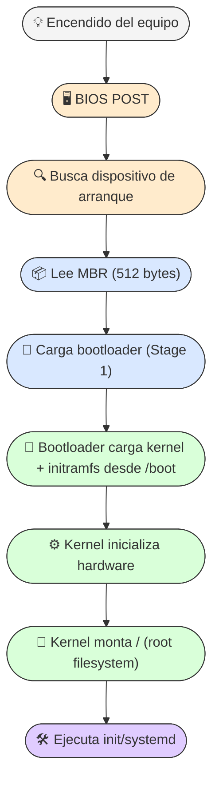
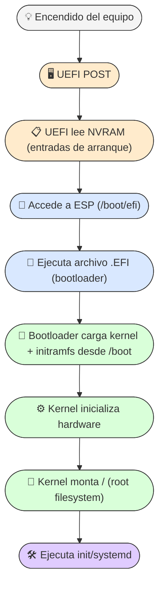
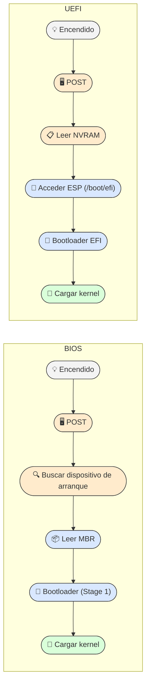

# Arranque de Linux: `/boot` y `/boot/efi`
Este documento busca explicar al usuario de **LiNUX** —que no solo quiere instalar y usar alguna Distribución de Linux, sino que además quiere aprender qué es, unificadamente, **UN SISTEMA OPERATIVO GNU/LiNUX, y qué mejor forme de lograr aquello que siguiendo el libro **Linux From Scratch (LFS)**— por lo tanto, en LFS4Students-ES iniciamos explicando todo lo que LFS da por sabido sobre las directorios (carpetas en el mundo Windows) y particiones involucradas en el arranque.

Se incluye algo de contexto histórico más las diferencias entre BIOS y UEFI, explicación técnica y visual, así como buenas prácticas.

---

# Contenido
Cuando construimos Linux desde cero —como propone el libro **Linux From Scratch (LFS)**—, hay muchas partes del proceso que el manual da por conocidas.  
Entre ellas, uno de los temas más críticos y menos explicados en detalle para el principiante es **el arranque del sistema**:  
qué ocurre desde que encendemos el equipo hasta que el sistema operativo está listo, qué papel cumplen las carpetas y particiones especiales como `/boot` y `/boot/efi`, y por qué existen diferentes formas de hacerlo según el hardware.

Este documento está diseñado para llenar ese vacío y explicar de manera clara, completa y progresiva todo lo que LFS asume que ya sabemos.  
Además, incluye diagramas visuales y ejemplos pensados para que incluso quien nunca haya instalado Linux pueda comprender el proceso.

## A lo largo de los **9 apartados** encontrarás:
### 1. **Introducción**  
   - Contexto general sobre BIOS y UEFI.  
   - La finalidad del documento: dar al novato las bases que LFS omite.

### 2. **Línea de tiempo (BIOS → UEFI)**  
   - Un recorrido histórico que muestra cómo pasamos del arranque tradicional (BIOS + MBR) al moderno (UEFI + GPT).  
   - Cuándo surgió cada innovación, por qué, y cómo afectó a `/boot` y `/boot/efi`.

### 3. **`/boot` como directorio en `/` vs `/boot` como partición independiente**  
   - Explicación técnica y práctica de ambas configuraciones.  
   - Ventajas, riesgos y casos en los que una u otra son recomendadas.  
   - Cómo influye el tipo de sistema de archivos y el cifrado.

### 4. **`/boot/efi` (ESP – EFI System Partition)**  
   - Qué es y por qué es obligatoria en UEFI.  
   - Su formato, contenido típico y función en el arranque.  
   - Cómo convive con otros sistemas operativos.

### 5. **BIOS Boot Partition (~1 MB)**  
   - Qué es, cuándo se necesita y qué papel cumple.  
   - Diferencia con `/boot` y `/boot/efi`.  
   - Casos concretos: GPT con BIOS.

### 6. **Ventajas y desventajas**  
   - Una tabla comparativa única para `/boot` como directorio, `/boot` como partición y `/boot/efi`.  
   - Te servirá como referencia rápida para tomar decisiones de instalación.

### 7. **Diagramas de flujo (versión visual para principiantes)**  
   - Tres diagramas Mermaid con íconos y colores.  
   - Representan paso a paso el arranque en BIOS, en UEFI y un comparativo directo.  
   - Pensados para que “entre por la vista” y se recuerde con facilidad.

### 8. **Notas técnicas**  
   - Puntos clave y limitaciones técnicas:  
     formato de la ESP, límites del MBR, capacidades de GPT, requisitos para GRUB, etc.  
   - Información útil para evitar errores en instalaciones avanzadas.

### 9. **Anexo – Explicación sencilla para principiantes**  
   - Una analogía doméstica para que cualquier persona entienda qué es `/boot`, `/boot/efi` y `/home`.  
   - Consejos prácticos para no romper el arranque por accidente.

### **En resumen:**  
Este documento te guiará desde lo más básico (qué es `/boot`) hasta lo más técnico (limitaciones de GPT, estructura de la ESP), con ejemplos y diagramas para que puedas instalar y arrancar Linux con confianza, incluso en configuraciones avanzadas.

---

# 1. Introducción
En Linux, el arranque es el proceso que ocurre desde que se enciende el equipo hasta que el sistema operativo está listo para usarse.  
Dependiendo del firmware de la placa base, este proceso puede seguir dos caminos:

- **BIOS** (estilo de arranque tradicional o "Legacy Boot")
- **UEFI** (estilo de arranque moderno, muchas veces es obligatorio -de facto- en hardware actual)

Para entender la estructura de `/boot` y `/boot/efi`, es importante conocer la evolución histórica y las limitaciones que motivaron su diseño.

---

# 2. Línea de tiempo (BIOS → UEFI)
| Año | Hito | Detalle técnico |
|-----|------|----------------|
| 1991–1994 | Linux + LILO | `/boot` como directorio en `/`. LILO cargaba el kernel desde el MBR o partición activa. |
| 1999 | GRUB (Legacy) | Se recomienda partición `/boot` para evitar límites de BIOS y problemas con FS complejos. |
| 2005–2010 | GRUB2 | Soporte para GPT y módulos. `/boot` como partición se vuelve opcional. |
| 2010–2015 | UEFI reemplaza BIOS | Nace la **EFI System Partition (ESP)**, montada en `/boot/efi` y formateada en FAT32. |
| 2015–hoy | Flexibilidad total | `/boot` puede ser directorio o partición; `/boot/efi` es obligatorio en UEFI. |

---

# 3. `/boot` como directorio en `/` vs `/boot` como partición independiente
## `/boot` dentro de `/` (sin partición separada)
- Es una carpeta más en el sistema de archivos raíz.
- Comparte espacio y formato de `/`.
- Más simple: no requiere montaje extra.
- **Limitación:** si `/` está en un FS que el bootloader no soporta (ej. btrfs con compresión, LVM, RAID, cifrado total), el arranque puede fallar.

## `/boot` como partición independiente
- Es un sistema de archivos separado, montado en `/boot`.
- Permite usar un FS simple (ej. ext4) para máxima compatibilidad con el bootloader.
- Indispensable si `/` está cifrado o en un FS complejo.
- **Nota:** Si existe una partición `/boot`, su montaje oculta cualquier `/boot` que exista dentro de `/`.
- **Tamaño recomendado:** 200–500 MB.

---

# 4. `/boot/efi` (ESP – EFI System Partition)
- **Propósito:** Guardar los cargadores UEFI (`*.efi`) y configuraciones mínimas de arranque.
- **Formato:** FAT32 (obligatorio por especificación UEFI).
- **Ubicación de montaje:** `/boot/efi`.
- **Contenido típico:**
  - GRUB EFI, systemd-boot, shim.
  - Configuración de arranque mínima.
- **Multi-OS friendly:** Puede contener cargadores de varios sistemas operativos.
- **Tamaño recomendado:** 200–500 MB (300 MB estándar).

---

# 5. BIOS Boot Partition (~1 MB)
- Solo necesaria en **GPT + BIOS**.
- Sin formato, reservada para `core.img` de GRUB cuando no cabe en el MBR.
- No es `/boot` ni `/boot/efi`.

## 1️⃣ Qué es MBR y GPT
- MBR (Master Boot Record)
- Edad: Muy antiguo, desde 1983.

**Qué hace**:
- Primer sector del disco (sector 0, 512 B).

**Contiene**:
- Código de arranque inicial (bootloader primario).
- Tabla de particiones (hasta 4 particiones primarias).

**Limitaciones**:
- Máx. 2 TB por disco (porque usa 32 bits para direcciones de bloque).
- Máx. 4 particiones primarias (o 3 primarias + 1 extendida).
- Sin redundancia: si se corrompe el MBR, el disco puede quedar inaccesible.

### GPT (GUID Partition Table)
**Edad**: Introducido con UEFI (finales de los 90s, adoptado ampliamente en 2005+).

**Qué hace**:
- Parte de la especificación UEFI.
- Cada disco tiene una tabla de particiones con GUID (identificador único global).

**Soporta**:
- Discos gigantes (hasta 9.4 ZB teóricos).
- Hasta 128 particiones por defecto en Windows.

**Redundancia**: tiene tabla primaria y copia de seguridad al final del disco.
- Checksums para detectar corrupción.

**Limitación**:
- Para arrancar desde un disco GPT, necesitas UEFI, no BIOS tradicional.

## 2️⃣ BIOS Boot Partition (~1 MB)
**Qué es**:
- Una pequeña partición que permite a un sistema con BIOS tradicional arrancar desde un disco GPT.
- Contiene el core del bootloader (por ejemplo GRUB) necesario para saltar del BIOS al sistema operativo.

**Tamaño**: Muy pequeño (~1 MB), porque solo guarda código, no archivos grandes.

**Por qué existe**:
- BIOS tradicional no entiende GPT, así que necesita un lugar donde colocar el bootloader que pueda leer antes de transferir el control al sistema operativo.

## Diagrama conceptual sencillo para visualizar MBR vs GPT vs GPT+BIOS Boot Partition

### 1️⃣ Disco con MBR (BIOS tradicional)
│ Sector 0: MBR                 │  <- Código de arranque + Tabla de particiones
|:------------------------------|
│ Partición 1                   │
│ Partición 2                   │
│ Partición 3                   │
│ Partición 4 (o extendida)     │

Notas:
- Max 2 TB por disco
- Max 4 particiones primarias
- Compatible con BIOS clásico

--------------------------------------------------

### 2️⃣ Disco con GPT (UEFI)
│ Sector 0: Protective MBR      │  <- Evita que herramientas antiguas vean disco vacío
|:------------------------------|
│ Tabla de particiones GPT      │
│ Partición 1 (EFI System)      │
│ Partición 2                   │
│ Partición 3                   │
│ Partición 4                   │
│ Backup GPT (final del disco)  │

**Notas**:
- Necesario UEFI para arrancar
- Soporta discos enormes y muchas particiones
- Redundante y seguro

--------------------------------------------------

### 3️⃣ Disco GPT con BIOS Boot Partition (GPT + BIOS)
│ Sector 0: Protective MBR      │
|:------------------------------|
│ BIOS Boot Partition (~1 MB)   │  <- Contiene bootloader para BIOS
│ Partición 1                   │
│ Partición 2                   │
│ Backup GPT (final del disco)  │

**Notas**:
- Permite arrancar GPT desde BIOS antiguo
- Partición muy pequeña, solo para bootloader
- Combina ventajas de GPT con compatibilidad BIOS

### 💡 Interpretación rápida para principiantes:
- MBR: todo en un solo sector, simple y limitado.
- GPT: moderno, seguro, con respaldo, necesita UEFI.
- GPT + BIOS Boot Partition: pequeño “truco” para que BIOS clásico pueda arrancar un disco GPT.

## 3️⃣ Cuándo usar MBR, GPT o combinación

| Caso                               | Recomendación             | Explicación                                                                       |
| ---------------------------------- | ------------------------- | --------------------------------------------------------------------------------- |
| Disco < 2 TB, BIOS clásico         | MBR                       | Simplicidad, compatibilidad máxima.                                               |
| Disco > 2 TB o UEFI                | GPT                       | Necesario para aprovechar tamaño y nuevas características.                        |
| Necesitas arrancar GPT desde BIOS  | GPT + BIOS Boot Partition | GPT + pequeña partición de 1 MB para bootloader (GRUB, etc.) que BIOS pueda usar. |
| Compatibilidad con antiguos OS     | MBR                       | Algunos sistemas antiguos no entienden GPT.                                       |

### ✅ Resumen práctico:
- MBR: viejo, simple, compatible.
- GPT: moderno, seguro, para discos grandes.
- GPT+MBR (o mejor dicho, GPT con BIOS Boot Partition): puente para arrancar GPT en sistemas BIOS antiguos.

---

# 6. Ventajas y desventajas
| Tipo | Ventajas | Desventajas |
|------|----------|-------------|
| `/boot` como directorio | Simplicidad. Sin montaje extra. | No funciona con FS incompatibles para el bootloader. Problemas con cifrado total. |
| `/boot` como partición | Compatible con FS complejos o cifrados. Menos riesgo de corrupción. | Espacio fijo. Montaje extra para actualizar kernel. |
| `/boot/efi` (ESP) | Obligatorio en UEFI. Multi-OS. | FAT32 sin permisos UNIX ni enlaces. Si se corrompe, el equipo no arranca. |

## Listado resumido de tipos de partición y sistemas de archivos típicos
Como en todo rubro de cosas y situaciones, siempre tenemos ventajas y desventajas, incluyendo típicas recomendaciones tanto para Linux y otros sistemas o usos. Tomando como ejemplo el formato de **/boot** en LFS que recomiendo **ext2**, se puede ampliar así:
| Partición / Directorio       | FS típico / recomendado                       | Ventajas                                                                               | Desventajas                                                                                         |
| ---------------------------- | --------------------------------------------- | -------------------------------------------------------------------------------------- | --------------------------------------------------------------------------------------------------- |
| `/boot` (partición separada) | **ext2** (clásico), ext3/ext4 también válidos | Simplicidad, confiable, sin journaling (ext2) → menor riesgo de corrupción en arranque | Espacio fijo, no aprovecha journaling de FS moderno (ext2), requiere montaje para actualizar kernel |
| `/` (root)                   | **ext4**, Btrfs, XFS                          | Ext4: estable, rápido; Btrfs: snapshots y checksums; XFS: grandes volúmenes            | Btrfs y XFS más complejos de recuperar; ext4 limitado a 1 archivo <16 TB                            |
| `/home`                      | **ext4**, Btrfs, XFS                          | Separación de datos de usuario → facilita reinstalación del OS; snapshots si Btrfs     | Necesita planificación de espacio; FS complejo aumenta riesgo de corrupción si se corta energía     |
| `/var`                       | **ext4**, XFS                                 | Archivos que cambian mucho (logs, DB, caches) → FS robusto y rápido                    | Puede crecer mucho; cuidado con el límite de espacio                                                |
| `/tmp`                       | **tmpfs** (RAM) o ext4                        | tmpfs: muy rápido, borrado al reiniciar; ext4: persistente                             | tmpfs usa RAM → cuidado con memoria; ext4 persistente puede acumular basura                         |
| `/boot/efi` (ESP)            | **FAT32**                                     | Obligatorio en UEFI, compatible con múltiples OS                                       | No soporta permisos UNIX, sin enlaces simbólicos; corrupción impide arranque                        |
| Swap                         | Swap FS (partición dedicada)                  | Permite suspender RAM, mejora estabilidad                                              | No almacena datos permanentes; usar demasiado reduce vida de SSD                                    |
| Datos multi-OS               | NTFS (Windows), exFAT                         | Compatible con Windows y Linux                                                         | No soporta permisos UNIX completos, menor integridad en Linux                                       |

## 💡 Regla general:

- Particiones de arranque (/boot): FS simple y confiable, ext2/ext4 sin complicaciones.
- Partición raíz (/): FS moderno y robusto, ext4 es estándar, Btrfs o XFS si quieres features avanzadas.
- Particiones de usuario (/home) y datos: elegir FS según tamaño, features y backup.
- EFI/UEFI (/boot/efi): FAT32 obligatorio, compatibilidad ante todo.

### Versión compacta visual tipo “tabla de referencia rápida”
│ Partición     │ FS recomendado│ Uso típico                     │ Riesgos / Consideraciones      │
|:--------------|:--------------|:-------------------------------|--------------------------------|
│ /boot         │ ext2 / ext4   │Arranque del sistema, kernel │ Espacio fijo, requiere montaje │
│ /             │ ext4 / Btrfs  │ Sistema raíz, programas        │ FS complejo puede ser difícil │
│               │ / XFS         │                                 │ de recuperar                  │
├───────────────┼───────────────┼───────────────────────────────┼───────────────────────────────┤
│ /home         │ ext4 / Btrfs  │ Datos de usuario               │ Planificar espacio, snapshots │
│               │ / XFS         │                                 │ si Btrfs                      │
├───────────────┼───────────────┼───────────────────────────────┼───────────────────────────────┤
│ /var          │ ext4 / XFS    │ Logs, bases de datos, caches   │ Crecimiento grande posible    │
├───────────────┼───────────────┼───────────────────────────────┼───────────────────────────────┤
│ /tmp          │ tmpfs / ext4  │ Archivos temporales             │ tmpfs usa RAM, ext4 persiste  │
├───────────────┼───────────────┼───────────────────────────────┼───────────────────────────────┤
│ /boot/efi     │ FAT32         │ EFI System Partition (UEFI)    │ No permisos UNIX, corrupción │
│               │               │ Multi-OS                       │ impide arranque               │
├───────────────┼───────────────┼───────────────────────────────┼───────────────────────────────┤
│ swap          │ Swap FS       │ Memoria virtual, suspender RAM │ No guarda datos permanentes   │
├───────────────┼───────────────┼───────────────────────────────┼───────────────────────────────┤
│ Multi-OS datos│ NTFS / exFAT  │ Compartir con Windows           │ Sin permisos UNIX completos   │
└───────────────┴───────────────┴───────────────────────────────┴───────────────────────────────┘

## 💡 Tips rápidos:
- /boot → FS simple y seguro, no journaling (ext2) si quieres máxima fiabilidad para el arranque.
- /boot/efi → FAT32 obligatorio para UEFI.
- /, /home, /var → elegir FS según tamaño, estabilidad y funcionalidades que quieras (ext4: seguro, Btrfs: avanzado).
- swap → usar según RAM disponible y necesidades de suspensión.
- Multi-OS → NTFS/exFAT solo si compartes con Windows; cuidado con permisos.

### Esquema visual tipo disco
Un esquema visual tipo disco, mostrando particiones y su FS recomendado.

          ┌───────────────────────────────┐
          │           /boot/efi           │  FAT32
          │ (EFI System Partition, UEFI) │
          └───────────────────────────────┘
          ┌───────────────────────────────┐
          │           /boot               │  ext2 / ext4
          │ (Kernel y arranque)           │
          └───────────────────────────────┘
          ┌───────────────────────────────┐
          │            /                  │  ext4 / Btrfs / XFS
          │ (Sistema raíz, programas)     │
          └───────────────────────────────┘
          ┌───────────────────────────────┐
          │           /home               │  ext4 / Btrfs / XFS
          │ (Datos de usuario)            │
          └───────────────────────────────┘
          ┌───────────────────────────────┐
          │           /var                │  ext4 / XFS
          │ (Logs, bases de datos, caches)│
          └───────────────────────────────┘
          ┌───────────────────────────────┐
          │           /tmp                │  tmpfs / ext4
          │ (Archivos temporales)         │
          └───────────────────────────────┘
          ┌───────────────────────────────┐
          │           swap                │  Swap FS
          │ (Memoria virtual)             │
          └───────────────────────────────┘
          ┌───────────────────────────────┐
          │    Multi-OS / Datos externos  │  NTFS / exFAT
          │ (Compartir con Windows)       │
          └───────────────────────────────┘

💡 Interpretación rápida:
**Arriba**: Particiones de arranque y EFI (pequeñas, críticas).
**Centro**: Sistema raíz y datos de usuario, aquí van la mayoría de archivos.
**Abajo**: Swap y particiones multi-OS o de datos externos, útiles pero menos críticas.

---

# 7. Diagramas de flujo (versión visual para principiantes)
### Arranque BIOS

### Arranque UEFI

### Comparativo BIOS vs UEFI

---

# 8. Notas técnicas
- La ESP debe ser FAT32 para garantizar compatibilidad con firmware UEFI.
- MBR está limitado a discos ≤ 2 TB.
- GPT soporta discos muy grandes (> 9.4 ZB).
- En GPT + BIOS se requiere BIOS Boot Partition (~1 MB).
- En UEFI, las rutas de cargadores están registradas en NVRAM.

---

# 9. Anexo – Explicación sencilla para principiantes
En Linux, al igual que en macOS y Windows, hablamos de directorios desde un punto de vista técnico o de programación. Pero en la interfaz gráfica de usuario (GUI), Apple utiliza el término “carpetas” (folders en inglés), igual que Windows.

### Así que, de forma práctica:
- Terminal o programación: directorios (directories).
- Interfaz gráfica / Finder: carpetas (folders).

Esto significa que si abres la Terminal en macOS, navegarás usando rutas de directorio como `/Users/usuario/Documents`, mientras que en Finder de  macOS y en el Esporador de Archivos de Windows, visualmente verás “Documentos” como una carpeta.

### Piensa en Linux como una casa bien organizada:
- **/boot**: Es el cuarto donde guardas lo que necesitas para arrancar (arranque del sistema).
- **/boot/efi**: Es como el vestíbulo del edificio, por donde entras si tienes una llave UEFI.
- **/home/usuario**: Tu habitación personal (donde van tus documentos en diveras categoríastales como, Vidéo/Música, Imágenes, Descargas, etc).

### **Regla de oro**:
- No guardes cosas en `/boot` o `/boot/efi` salvo que sepas exactamente lo que haces.
- Tus archivos deben ir en /home.

## Datos Anecdóticos - ¿Directorios o Carpetas?

No hay un estándar formal único que dicte que los sistemas operativos deben usar “carpetas” o “directorios” en su interfaz gráfica, pero sí hay algunas normas y tradiciones históricas que guían la terminología:

### 1- **POSIX** (Portable Operating System Interface)
- Define cómo se deben manejar archivos y directorios a nivel de sistema.
- Habla exclusivamente de “directories”.
- Esto aplica a Linux, macOS (que es Unix-based) y otros sistemas compatibles con POSIX.
- No dicta la terminología de la GUI.

### 2- Convención de interfaces gráficas - **GUI**
- Apple adoptó “folders” en el Finder, siguiendo la metáfora física de carpetas para organizar documentos.
- Microsoft hizo lo mismo con Windows.
- Esta terminología se basa en metáforas visuales y usabilidad, no en un estándar técnico formal.

### 3- Estándares de **Interoperabilidad/ISO**
- ISO/IEC 9945 (POSIX) solo habla de directorios a nivel de sistema, no de cómo mostrarlos en GUI.
- No existe un estándar ISO que obligue a usar “folder” vs “directory” en un escritorio gráfico.

## ✅ Conclusión:

- A nivel técnico / programación, se usa “directory” o “directorio”.
- A nivel usuario / interfaz gráfica, “carpeta” (folder) es una convención empírica, basada en la metáfora de oficina, y cada sistema la adopta como le conviene.

### Historia detrás de la lógica técnica del concepto “directorios”

El término “directorio” (directory en inglés) proviene de la informática temprana, cuando los sistemas de archivos empezaron a organizar información de manera jerárquica:

### 1- Metáfora técnica vs física
- Mientras “folder” viene de la metáfora física de una carpeta de oficina que contiene papeles, “directory” viene de la idea de “directorio de referencias”.
- Un directorio no necesariamente contiene los archivos físicamente; más bien apunta o referencia a ellos. Es un mapa que indica dónde se encuentra cada archivo en el almacenamiento.

### 2- Origen histórico
- En los primeros sistemas Unix y Multics (años 60-70), un “directory” era un listado estructurado de nombres de archivos y sus ubicaciones en disco.
- Su función era dirigir al sistema hacia los bloques de datos correctos, de ahí “directory” → “directorio” (literalmente “que dirige”).

### 3- Implicación técnica
- Un directorio puede contener archivos y otros directorios (subdirectorios), formando una estructura jerárquica en árbol.
- No importa si el usuario lo ve como una carpeta; para el sistema, es más un registro organizado de punteros.

### Resumen:
- Folder (carpeta): metáfora visual para el usuario, física y concreta.
- Directory (directorio): concepto técnico, abstracto, orientado a organización y referencias dentro del sistema de archivos.
